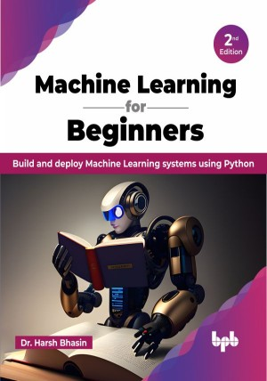

# Machine Learning for Beginners - 2nd Edition

Unlock the potential of design patterns to write better code in C# 11 and .NET 7

Learn how to build a complete machine learning pipeline by mastering feature extraction, feature selection, and algorithm training
](https://bpbonline.com/products/machine-learning-for-beginners-2nd-edition),published by BPB Publications.

## About the Book
The second edition of “Machine Learning for Beginners” addresses key concepts and subjects in machine learning. 

The book begins with an introduction to the foundational principles of machine learning, followed by a discussion of data preprocessing. It then delves into feature extraction and feature selection, providing comprehensive coverage of various techniques such as the Fourier transform, short-time Fourier transform, and local binary patterns. Moving on, the book discusses principal component analysis and linear discriminant analysis. Next, the book covers the topics of model representation, training, testing, and cross-validation. It emphasizes regression and classification, explaining and implementing methods such as gradient descent. Essential classification techniques, including k-nearest neighbors, logistic regression, and naive Bayes, are also discussed in detail. The book then presents an overview of neural networks, including their biological background, the limitations of the perceptron, and the backpropagation model. It also covers support vector machines and kernel methods. Decision trees and ensemble models are also discussed. The final section of the book provides insight into unsupervised learning and deep learning, offering readers a comprehensive overview of these advanced topics.

By the end of the book, you will be well-prepared to explore and apply machine learning in various real-world scenarios.

## What You Will Learn
•  Acquire skills to effectively prepare data for machine learning tasks.

•  Learn how to implement learning algorithms from scratch.

•  Harness the power of scikit-learn to efficiently implement common algorithms.

•  Get familiar with various Feature Selection and Feature Extraction methods.

•  Learn how to implement clustering algorithms.
